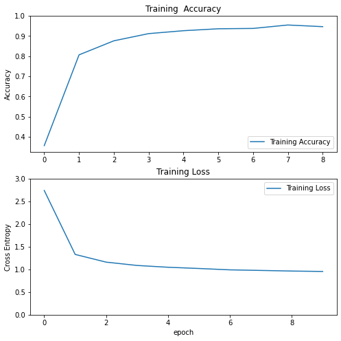

# 🛒 CUTN Grocery Shopping App

An Android grocery app where you **snap a photo of a product to search for it**. Recognition runs fully on-device with a TensorFlow Lite model we trained on a custom grocery dataset.

## ✨ Features
- 📷 **Snap-to-search** — point your camera at a fruit or veg and it's identified instantly, on-device
- 🗂️ Browse by category, popular items, and the full catalogue
- 🛍️ Shopping cart with quantity controls and checkout
- 🎁 Rewards and a smooth, animated UI
- 💾 Works offline via a local database

## 🧠 The model
The classifier is a custom **TensorFlow Lite** model trained with **TFLite Model Maker** on a grocery image dataset of **35 classes** (Apple, Banana, Mushroom, Zucchini …). It ships embedded in the app as `GroceryModel.tflite`, so inference happens entirely on-device with no network call.

- Training notebook — [`Grocery_Classification_with_TFLite_Model_Maker.ipynb`](documents_and_report/Grocery_Classification_with_TFLite_Model_Maker.ipynb)
- Dataset & labels — [`dataset/`](dataset/)

## 🛠️ Built with
Kotlin · Android SDK (min 21) · TensorFlow Lite · PaperDB

## 📦 Try it
- 📱 Install the APK — [`apk/CUTN Grocery Shop App.apk`](apk/)

## 🏗️ Architecture

